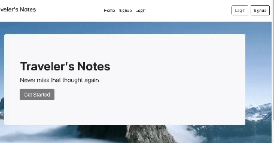
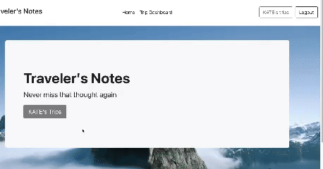
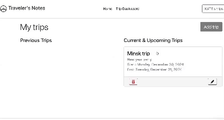

# TravelNotes

Travel Notes is a MERN (MongoDB, Express, React, Node.js) application that allows you to take notes while your journey.

---

## Getting Started

To set up and run the project locally, follow these steps:

### Prerequisites

Ensure you have the following installed on your system:
- [MongoDB](https://www.mongodb.com/docs/manual/installation/) (running locally or accessible remotely)
- [Node.js and npm](https://nodejs.org/)

### Installation and Setup

1. **Clone the repository**  
   Clone this repository to your local machine.

2. **Install dependencies**  
   Run the following command in the **root directory** of the project:
   ```bash
   npm install
   ```   
Then navigate to the client directory:
   ```bash
    cd client
    npm install
```
 Keep in mind that you also need to create .env file in the root directory of the project. 
 There you should place your secret key for jwt token generation.
 Sample of .env file:
```bash
AUTH_SECRET='YOUR_SECRET_KEY_HERE'
```

3. **Start the application**
  
    Start the backend server from the root directory:

   ```bash
    npm start
    ```
   
    Then start the frontend from the client directory:
   ```bash
    cd client
    npm start
    ```

4. **Access the application**

Open your browser and navigate to http://localhost:3000 to access the application.

5. **Demonstration of sign up function**



6. **Demonstration of adding trip function**



7. **Demonstration of editing trip function**

